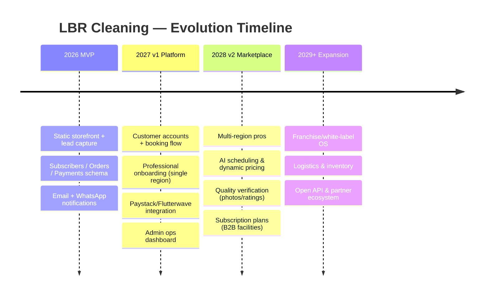
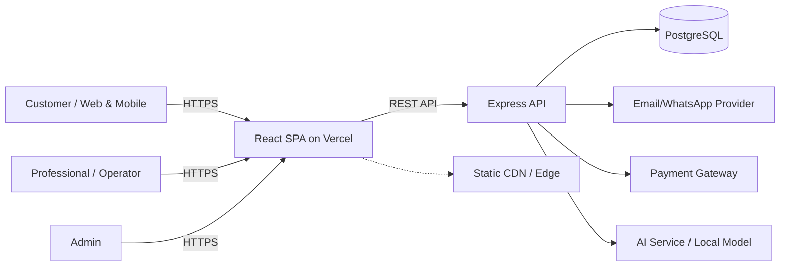
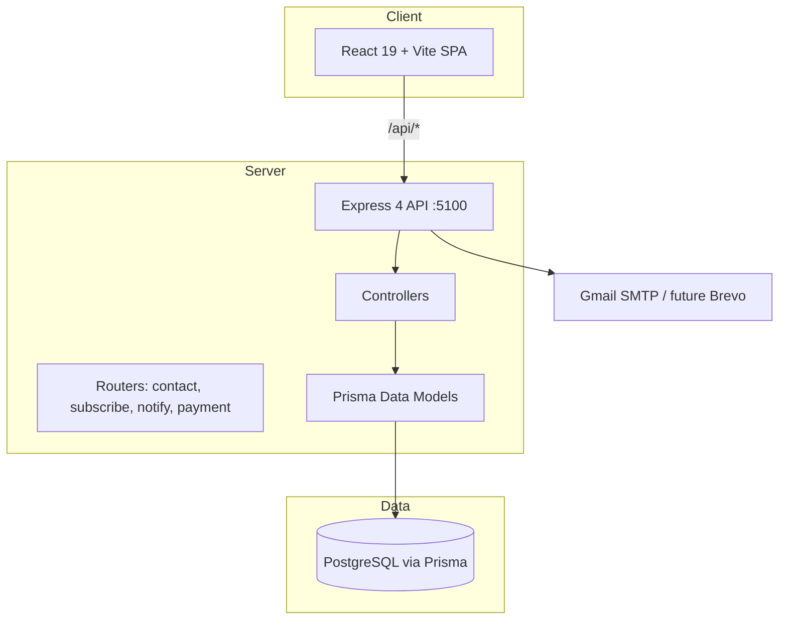
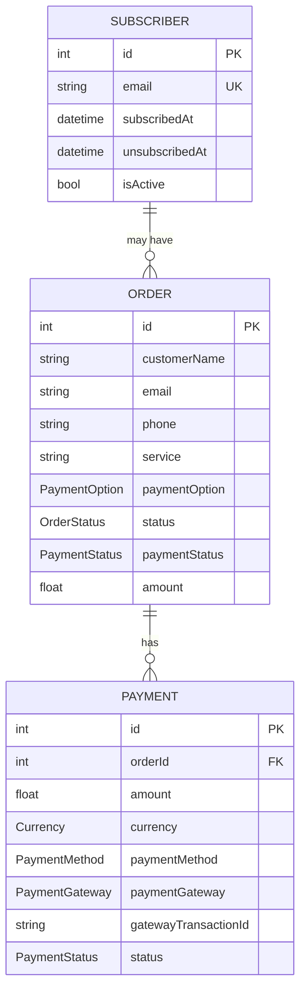
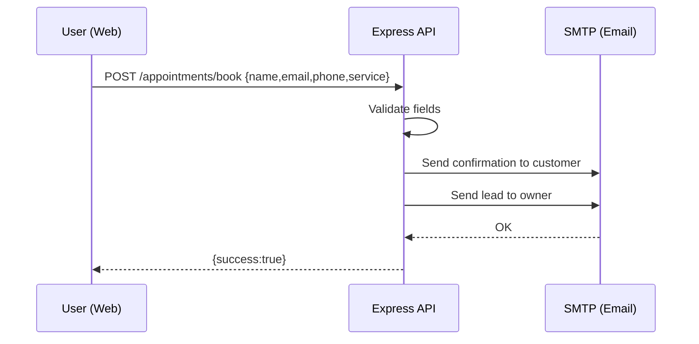
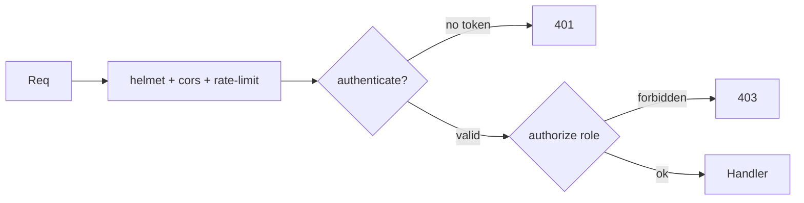
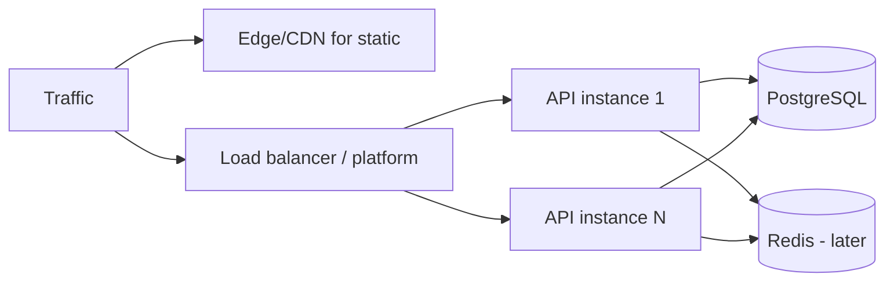

# LBR Cleaning — Engineering Blueprint & Product Vision

> **Status:** Living document / Single Source of Truth
> **Owner:** Solo founder + AI-assisted maintainers
> **Audience:** Future contributors, AI coding assistants, and the founder
> **Last revised:** 2026-07-13

This document is the canonical reference for the **LBR Cleaning** platform. It explains not only what the codebase is today, but what it is *becoming* — a scalable, AI-augmented field-service operations platform for home and facility care across emerging markets. Read it end-to-end before writing a single line of code.

---

## 1. Executive Summary

LBR Cleaning begins as a single cleaning-services company website: a React storefront backed by an Express + PostgreSQL API that captures leads, bookings, newsletter subscribers, and payments. That is the **seed**, not the destination.

The strategic bet is that the informal, fragmented home-and-facility-services sector in markets like Nigeria is ripe for software consolidation. Thousands of small cleaning, fumigation, and facility-management businesses operate on WhatsApp, paper, and word-of-mouth. The long-term vision is for LBR Cleaning to evolve from *a vendor* into a **platform and operating system for property-care services**: a two-sided marketplace where customers book vetted professionals, operators run调度 (scheduling), quality, and payments through one backbone, and AI continuously optimizes pricing, routing, and trust.

Crucially, this must be achieved by **one developer on a near-zero budget**. Every architectural decision in this document is optimized for:

1. **Starting at ~$0/month** (free tiers, open source, self-hosting).
2. **Scaling to thousands of users** without a rewrite.
3. **Evolving into a large platform** by adding modules, not replacing foundations.

The current codebase already contains the right primitives — `Subscriber`, `Order`, `Payment` models, a notification engine, and a componentized React frontend — that we will grow into this platform.

---

## 2. Mission and Vision

### Mission
> *Make professional property-care services universally accessible, trustworthy, and efficiently delivered — starting in Nigeria, scaling across emerging markets.*

### Vision (3–5 year horizon)
To become the **default operating layer for home and facility services** in Africa and similar markets: a platform where a customer books in seconds, a professional is dispatched intelligently, payment is handled seamlessly, and quality is verified automatically.

### North-star metrics (eventual)
- **GMV** processed through the platform.
- **Time-to-first-booking** (customer side).
- **Fill-rate / utilization** (professional side).
- **Repeat-booking rate** (trust signal).

---

## 3. The Real-World Problem We Solve

| Stakeholder | Today's pain | How the platform helps |
|---|---|---|
| **Customers** | No reliable way to find vetted cleaners; pricing is opaque; no recourse. | Transparent catalog, fixed/AI pricing, reviews, escrowed payments. |
| **Professionals / SMEs** | Lead generation is manual (WhatsApp groups), scheduling is chaotic, no records. | Shared dispatch board, CRM, automated reminders, digital payments. |
| **Platform (us)** | Single-vendor revenue ceiling. | Marketplace take-rate, SaaS subscriptions, data monetization (anonymized). |

The **current code** solves the *first 5%*: capturing intent (booking, contact, subscription) and notifying. The roadmap scales that into fulfillment.

---

## 4. Core Philosophy & Guiding Principles

1. **Bootstrap-first.** No dependency that costs money until it earns money. Free tier → low-cost → enterprise, in that order.
2. **Monolith now, modular later.** A single Express service is fine until it isn't. We design clean module boundaries so extraction into services is mechanical, not heroic.
3. **Data is the moat.** Capture structured orders, payments, and behavior from day one. AI value compounds with data.
4. **Mobile-first, low-bandwidth tolerant.** Many users are on 3G/4G with limited data. Ship lean.
5. **Open by default.** Prefer open-source, self-hostable, and portable tech so we are never locked in.
6. **Security is not optional, even on a budget.** Use free, battle-tested libraries (helmet, rate-limit, bcrypt, JWT).
7. **AI as a feature, not a foundation.** AI augments proven workflows; it never replaces the core transaction path.

---

## 5. Long-Term Roadmap



### Phase detail

**MVP (Now → 6 months) — *"Capture & Convert"***
- Stabilize current site; fix architecture debt (Section 24).
- Replace env-password admin with real auth (JWT + roles).
- Production DB (free Postgres), proper email (free tier), observability (free).
- Goal: reliably convert visitors into bookings and subscribers.

**Version 1 (6–18 months) — *"Operate"***
- Customer accounts, persistent bookings, status tracking.
- Professional onboarding for one city; manual dispatch dashboard.
- Real payment gateway (Paystack/Flutterwave) with webhooks.
- goal: first **paid transactions** beyond the founder's own jobs.

**Version 2 (18–36 months) — *"Optimize & Scale"***
- AI-assisted scheduling, routing, and dynamic pricing.
- Reviews, photo-verified quality, disputes/escrow.
- B2B recurring facility contracts.
- Goal: marketplace liquidity in 2–3 cities.

**Future Expansion (36m+) — *"Platform"***
- White-label OS for other service verticals (repair, landscaping, security).
- Open partner API, logistics, inventory.
- Goal: regional category leader.

---

## 6. System Architecture

### 6.1 Context diagram



### 6.2 Container view (current)



Today the API is a **single Node process**. The migration boundary is already drawn (`src/` is the PostgreSQL/Prisma world; root `controllers/`, `models/`, `routes/` are legacy MongoDB leftovers — see Technical Debt).

---

## 7. Folder & Codebase Structure

```
lbr-cleaning/
├── ibrfront/                 # React 19 frontend (Vite)
│   ├── src/
│   │   ├── pages/            # Route-level screens (Home, Service, Blog, About, Contact, Notify, Admin, 404)
│   │   ├── component/        # Reusable UI (Hero, Nav, Footer, Deals, Testimonials, etc.)
│   │   ├── assets/           # Images, video (NOTE: large binary assets — see debt)
│   │   ├── App.jsx           # Router root
│   │   └── main.jsx
│   ├── public/               # Static served files
│   ├── vercel.json           # SPA rewrite rules
│   └── vite.config.js
├── ibrback/                  # Express API
│   ├── src/                  # ✅ Active Prisma/PostgreSQL code
│   │   ├── config/           # database.js (Prisma client)
│   │   ├── models/           # subscriber, order, payment (Prisma wrappers)
│   │   ├── controllers/      # business logic
│   │   └── routes/          # Express routers
│   ├── controllers/          # ⚠️ LEGACY MongoDB code (duplicate)
│   ├── models/               # ⚠️ LEGACY mongoose schemas
│   ├── routes/               # ⚠️ LEGACY routers (unused by app.js)
│   ├── prisma/
│   │   └── schema.prisma     # ✅ Source of truth for DB
│   ├── app.js                # Entrypoint (wires src/ routers)
│   └── MIGRATION_GUIDE.md
├── python/                   # Automation / content tooling
│   ├── extract_pdf_content.py# PyMuPDF PDF→text/images extractor
│   └── infra/docker-compose.yml  # ⚠️ Empty placeholder
└── README.md                 # ⚠️ Currently a single line
```

---

## 8. Technology Stack

| Layer | Current | Choice rationale | Future |
|---|---|---|---|
| Frontend | React 19, Vite 6, react-router-dom 7, framer-motion, react-toastify, axios | Fast, free, huge ecosystem | Add TanStack Query, Zod; maybe React Native / PWA for mobile |
| Backend | Node 18+, Express 4, Prisma 5 | Minimal, free, typed schema | NestJS or fastify if complexity grows |
| DB | PostgreSQL (Prisma ORM) | Relational integrity, free tiers abundant | Same engine; read replicas later |
| Email | Gmail SMTP (nodemailer) | $0 to start | Brevo/Resend free tier |
| Messaging | (planned) Twilio/WhatsApp | package present but unused | Twilio WhatsApp sandbox (free) |
| Payments | schema only (Paystack/Flutterwave/Stripe enums) | Local-market fit | Real gateway integration |
| Infra-as-code | empty docker-compose | — | Docker Compose → optional K8s later |
| CI/CD | none | — | GitHub Actions (free) |

---

## 9. Database Design

Single PostgreSQL database, accessed through Prisma. Three core entities today:



These enums already anticipate multi-currency, multi-gateway, multi-status workflows — a strong foundation.

**Missing but planned:** `User` (accounts), `Professional`/`Provider`, `Booking` (scheduled slots), `Review`, `Address`, `SubscriptionPlan`, `NotificationLog`. The roadmap adds these as new Prisma models without disturbing existing ones.

> **Note:** `prisma/migrations/` is referenced in `MIGRATION_GUIDE.md` but **no migration files are committed**. Run `prisma migrate dev` to generate them, or use `prisma db push` for prototyping (not for production).

---

## 10. API Structure

Base URL: `http://localhost:5100` (dev) / env `VITE_API_URL` (prod).

| Method | Path | Purpose | Auth |
|---|---|---|---|
| GET | `/welcome` | Health/hello | public |
| POST | `/appointments/book` | Booking email (legacy inline in app.js) | public + rate-limited |
| POST | `/api/contact` | Contact form → emails | public + rate-limited |
| POST | `/api/subscribe` | Add newsletter subscriber | public |
| GET | `/api/subscribe` | List all subscribers | ⚠️ **should be admin** |
| POST | `/api/admin-login` | Plain password check | none (see debt) |
| POST | `/api/send-message` | Broadcast email to subscribers | ⚠️ **no auth** |
| POST | `/api/unsubscribe` | Soft unsubscribe | public |
| DELETE | `/api/delete/subscribe` | Delete ALL subscribers | ⚠️ **no auth** |
| POST | `/api/notify-subscribers` | Notify all subscribers | ⚠️ **no auth** |
| POST | `/api/payment/initialize` | Create payment record | public |
| POST | `/api/payment/verify` | Update payment/order status | gateway/webhook |
| GET | `/api/payment/:id/status` | Payment status | public |
| GET | `/api/payment/order/:id` | Payments for order | public |

### Booking flow (today)



> **Target flow** replaces the inline `app.js` handler with a proper `src/routes/booking.js` + controller + `Order` persistence, with the lead also pushed to the dispatch board.

---

## 11. Authentication & Authorization

**Today (problematic):**
- Admin "auth" is a plain string compare against `ADMIN_PASSWORD` env var (no hashing, no token).
- Lockout counter (`wrongAttempt`) lives in **server memory** — resets on every restart and is shared across all users.
- Admin endpoints (`/api/send-message`, `/api/notify-subscribers`, `/api/delete/subscribe`, `/api/subscribe` GET) have **no middleware** guarding them.
- Frontend `AdminMessagePage` even hardcodes `http://localhost:5100` in one fetch while using `VITE_API_URL` elsewhere.

**Target (v1):**
- `User` model with `role` (`CUSTOMER`, `PROFESSIONAL`, `ADMIN`, `SUPERADMIN`).
- `bcrypt` (already a dependency) for password hashing.
- `jsonwebtoken` (add) for signed sessions; refresh tokens optional later.
- Central `authenticate` + `authorize(role)` middleware applied to all `/api/admin/*` and mutation routes.
- Lockout tracked per-IP + per-account in DB or Redis (free tier acceptable).



---

## 12. Frontend Architecture

- **Pattern:** Component-per-folder with co-located CSS (`About.jsx` + `about.css`). Pages compose components.
- **Routing:** `react-router-dom` v7, `BrowserRouter`, with a `ScrollToTop` helper. SPA fallback handled by `vercel.json` rewrite.
- **State:** Local component state + a few shared component trees. **No global store yet** — add Zustand or React Context for auth/cart in v1.
- **Data fetching:** Direct `axios` calls to `VITE_API_URL`. **Add TanStack Query** for caching/retries in v1.
- **Styling:** Plain CSS files (no Tailwind). Fine for now; consider CSS Modules or Tailwind if team grows.
- **Assets:** Heavy use of local JPG/PNG/MP4 in `src/assets/` (30+ blog images, video). These bloat the bundle — move to a CDN/storage (Section 20).

### Page inventory (current)

| Route | Component | What it shows | What it stands for |
|---|---|---|---|
| `/` | `Home` | Hero, About snippet, service cards, working process, portfolio, pricing plans, testimonials, latest articles | The **storefront & first impression** — converts visitors to leads |
| `/service` | `Service` | 6 detailed services (home, office, carpet, window, move, sanitization), plans, deals | The **catalog** — explains what we sell |
| `/services/:serviceId` | `ServiceDetails` | Deep-dive into one service | **Product detail** page (future booking CTA) |
| `/blog` | `Blog` | Article list (currently seeded with apologetics content) | **Content/SEO engine** — top-of-funnel traffic |
| `/about` | `About` | Company story, team, video, core values | **Trust & brand** — who we are |
| `/contact` | `Contact` | Contact form, map, hours, FAQ | **Conversion** — capture intent & support |
| `/notify` | `NotifySubscribers` | Textarea to "notify all subscribers" | **Operator broadcast** (⚠️ unauthenticated today) |
| `/admin/message` | `AdminMessagePage` | Password gate → broadcast message | **Admin console v0** (⚠️ weak auth) |
| `*` | `NotFoundPage` | 404 | Graceful fallback |

> **Content note (honest):** The blog content currently mixes cleaning articles with Christian-apologetics essays. For a coherent brand, blog content should be unified under cleaning/Home-care/wellness topics. The `python/extract_pdf_content.py` script suggests a content-ingestion pipeline; formalize it as a CMS-free markdown/MDX authoring flow.

---

## 13. Backend Architecture

- **Entry:** `app.js` — sets Express, `cors`, `helmet`, global `rateLimit` (50 req / 15 min), JSON body parser, nodemailer transporter, and mounts routers.
- **Layered:** `routes → controllers → models`. Clean and extensible.
- **Email:** Nodemailer with Gmail. Each controller re-creates its own transporter (duplicated config) — consolidate into `src/config/mailer.js`.
- **No centralized error handler** — each controller does `try/catch` returning `{success, message}`. Add an `errorHandler` middleware + consistent response shape (`ApiResponse` util).
- **No request validation** beyond inline checks — add `zod` schemas per route.

---

## 14. AI Integration Strategy

AI is a **force multiplier**, never a crutch. Three tiers, cheapest first:

1. **Free / local (MVP):** `Ollama` running a small model (e.g., `llama3.2`, `mistral`) on the dev machine or a free-tier VM for: draft email replies, summarize subscriber feedback, generate blog outlines, classify contact-form intent.
2. **Low-cost API (v1):** `OpenRouter` / `Groq` / `Gemini Flash` free-or-cheap tiers for: dynamic pricing suggestions, smart dispatch ranking, churn prediction on subscribers, auto-responses.
3. **Enterprise (v2+):** Managed `OpenAI`/`Azure OpenAI` with fine-tunes, vector DB (pgvector, free on Postgres) for semantic search over services & reviews.

**Guardrails:** AI never authorizes payments or deletes data. All AI output is logged and human-reviewable. Keep prompts/versioned in `python/` or a future `ai/` service.

---

## 15. Scalability Strategy

The architecture scales along three axes without a rewrite:



- **Stateless API:** No in-memory session state (fix the lockout counter!). Horizontal replicas are trivial.
- **DB:** Start on a free managed Postgres; scale compute/storage; add read replica + `pgbouncer` later.
- **Cache:** Redis (free tier / self-hosted) for subscriber lists, rate-limit counters, session store.
- **Async jobs:** Move email/broadcast to a queue (BullMQ + Redis, or a free Cron/worker) so a 10k-subscriber blast doesn't block the request.
- **CDN:** All static assets & the SPA on edge (Vercel/Cloudflare) — near-zero cost, global latency win.
- **Thousands of users:** Easily handled by 1–2 small API instances + one Postgres instance on low-cost hardware (Hetzner €4–5/mo, Fly/Render $5–7/mo).

---

## 16. Security Considerations

| Area | Current | Required action |
|---|---|---|
| Transport | HTTPS via host (Vercel) ✅; API must enforce TLS | Terminate TLS at platform; redirect HTTP→HTTPS |
| Headers | `helmet()` ✅ | Keep; tune CSP for inline styles |
| Rate limit | Global 50/15min ✅ | Per-route limits (auth attempts stricter) |
| Secrets | `.env` (good) but **hardcoded Gmail in code** (`sundayudoh383@gmail.com`) | Remove all hardcoded emails/keys; use env |
| Auth | Plain password compare, in-memory lockout | JWT + bcrypt + DB-backed lockout (Section 11) |
| Authz | Admin routes open | `authorize` middleware on all mutations |
| Input | Minimal validation | `zod` schemas; sanitize HTML in emails |
| Email injection | User input interpolated into email/HTML | Escape; use templating lib (e.g., MJML/HtmlToText) |
| Dependency | Many native deps (bcrypt, twilio) | `npm audit`; pin; remove unused (twilio if unused) |
| CORS | `cors()` wide open | Restrict to known origins via env |

---

## 17. Performance Optimizations

- **Frontend:** Code-split routes (`React.lazy`), lazy-load images (`loading="lazy"` already used in places), move heavy `assets/` to object storage + CDN, enable Vite build compression.
- **Backend:** Pool DB connections (Prisma does this), index hot columns (schema already indexes email/status/createdAt ✅), paginate `findAll` (already capped at 50/100).
- **Email blast:** Currently loops `await sendMail` serially — batch/BCC or queue it.
- **Caching:** Cache subscriber counts, service catalog (rarely changes) at edge or in Redis.
- **Monitoring:** Free uptime + error tracking (Better Stack / UptimeRobot / Sentry free).

---

## 18. Accessibility Goals

- Target **WCAG 2.1 AA**.
- Semantic HTML (`<main>`, `<nav>`, `<section>`, headings order) — already partially done.
- Ensure color contrast (current green-on-cream meets most needs; verify).
- Keyboard navigation for all forms/menus; focus styles.
- `alt` text on all images (some are decorative — mark `alt=""` intentionally).
- Respect `prefers-reduced-motion` (framer-motion animations).
- Forms labeled; error messages announced (aria-live) — `CustomAlert` already exists; wire `role="alert"`.

---

## 19. Deployment Strategy

Principle: **free now, low-cost as you earn, enterprise when justified.** Each layer below lists all three options.

### Frontend (React SPA)
- **Free:** Vercel / Netlify / Cloudflare Pages (git-connected auto-deploy). *Already on Vercel.*
- **Low-cost:** Same providers' paid tiers (~$0–20/mo) or a $4 VPS + Nginx + CI build.
- **Enterprise:** AWS CloudFront + S3, or Vercel Enterprise with edge functions.

### Backend (Express API)
- **Free:** Render free tier, Railway free allowance, Fly.io free, **Oracle Cloud Always-Free VM** (great for a solo dev).
- **Low-cost:** Render/Railway ~$5–7/mo, Hetzner CX11 ~€4–5/mo, Fly autosuspend.
- **Enterprise:** AWS ECS/Fargate, GCP Cloud Run, Kubernetes.

### Database (PostgreSQL)
- **Free:** Supabase free, Neon free, Railway free Postgres, Render free PG, **Oracle Always-Free + self-managed Postgres**.
- **Low-cost:** Supabase Pro ~$25, Neon, Hetzner managed ~$4, DigitalOcean Managed PG ~$15.
- **Enterprise:** AWS RDS, GCP Cloud SQL, Aurora.

### Email
- **Free:** Gmail SMTP (now), Brevo free (300/day), Resend free (3k/mo).
- **Low-cost:** Brevo/Resend paid by volume.
- **Enterprise:** SendGrid, Mailgun, Amazon SES (very cheap at scale).

### Object Storage (images/video)
- **Free:** Cloudinary free, Supabase Storage, **Cloudflare R2 free 10GB egress**.
- **Low-cost:** R2, Backblaze B2.
- **Enterprise:** AWS S3 + CloudFront.

### Payments
- **Free to integrate:** Paystack / Flutterwave (NG-focused), Stripe — you pay only per-transaction fees. No monthly cost.

### Observability / CI
- **Free:** GitHub Actions, Better Stack, UptimeRobot, Sentry free, Grafana Cloud free.
- **Low-cost:** Paid tiers of the above.
- **Enterprise:** Datadog, New Relic.

### Master cost table (solo, pre-revenue)

| Component | Free | Low-cost | Enterprise |
|---|---|---|---|
| Frontend | $0 (Vercel) | $0–20 | Custom |
| Backend | $0 (Oracle/Render) | ~$5–7 | Managed K8s |
| DB | $0 (Supabase/Neon/Oracle) | ~$4–25 | RDS |
| Email | $0 (Brevo/Resend) | volume | SendGrid |
| Storage | $0 (R2/Cloudinary) | ~$0–5 | S3 |
| Domain | $0 (subdomain) | ~$10/yr | multi |
| **Total** | **~$0/mo** | **~$15–40/mo** | scales w/ revenue |

---

## 20. Testing Strategy

Currently **no automated tests** (frontend `test` script is a stub; backend has none).

Target pyramid:
- **Unit (free):** `vitest` (frontend), `jest`/`node:test` (backend). Test controllers/models with Prisma mocked or use a throwaway test DB.
- **Integration:** `supertest` hitting the Express app against a ephemeral Postgres (GitHub Actions + Neon branch DB — free).
- **E2E:** `Playwright` (free, local + CI) for critical booking/contact flows.
- **Contract:** Document API with OpenAPI; generate client types.
- **AI tests:** Snapshot-test prompts/outputs; never assert exact LLM text.

---

## 21. Coding Standards

- **Language:** JavaScript (Node 18+). Consider TypeScript migration in v1 for the API (Prisma already gives types) — high leverage, low cost.
- **Formatting:** ESLint (frontend has `eslint.config.js`; add for backend). Use Prettier.
- **Naming:** `camelCase` JS, `PascalCase` components, `UPPER_SNAKE` enums (DB).
- **Structure:** `routes → controllers → models`; one responsibility per file.
- **Errors:** Consistent envelope `{ success, data?, message? }`; central handler.
- **Secrets:** Never commit; `.env` git-ignored (verify both `ibrback/.gitignore` and `ibrfront/.gitignore`).
- **Commits:** Conventional Commits (`feat:`, `fix:`, `chore:`). Small, reviewable PRs.

---

## 22. Contribution Guidelines

Even as a solo project, write as if a community will join:
1. Fork → branch (`feat/...`, `fix/...`).
2. Run lint + tests locally.
3. Keep `prisma/schema.prisma` as DB source of truth; generate migrations.
4. Document new env vars in `.env.example`.
5. Update this `PROJECT.md` when architecture changes.
6. Open a PR with a clear description and linked issue.

---

## 23. Development Workflow

```mermaid
flowchart LR
    A[Issue / task] --> B[Feature branch]
    B --> C[Code + lint + tests]
    C --> D[PR]
    D --> E[CI: lint + test]
    E --> F[Review / merge to main]
    F --> G[Auto-deploy: Vercel (FE) + Render/Fly (API)]
```

Suggested commands:
```bash
# Backend
cd ibrback && cp .env.example .env && npm install
npx prisma generate && npx prisma migrate dev
npm run dev          # http://localhost:5100

# Frontend
cd ibrfront && npm install
npm run dev          # Vite dev server
```

---

## 24. Known Limitations (honest)

1. **Architectural fork:** Active code is in `src/`; root `controllers/`, `models/`, `routes/` are legacy MongoDB duplicates that `app.js` does **not** use. Confusing and risky.
2. **No DB migrations committed** despite `MIGRATION_GUIDE.md` referencing them.
3. **No real auth** — admin endpoints are open or use a plain env compare; lockout is in-memory.
4. **Hardcoded secrets/identities** (`sundayudoh383@gmail.com`) in several controllers.
5. **No tests, no CI, no lint on backend.**
6. **Email blast is serial and blocking.**
7. **Heavy local assets** bloat the SPA bundle.
8. **Inconsistent API base** (`localhost:5100` hardcoded in `AdminMessagePage`).
9. **Blog content off-brand** (apologetics essays).
10. **Empty `docker-compose.yml`** and unused `twilio`/`bcrypt` deps.

---

## 25. Future Features (roadmap backlog)

- Customer accounts & saved addresses
- Professional onboarding, KYC, ratings
- Real-time dispatch board + map routing
- AI dynamic pricing & no-show prediction
- Subscriptions / B2B facility contracts
- In-app chat (WhatsApp bridge)
- Multilingual (English, Pidgin, French)
- Offline-first PWA for low bandwidth
- Open partner API & webhooks
- Analytics dashboard (Metabase — free, self-host)

---

## 26. Technical Debt (tracked)

| ID | Debt | Impact | Fix |
|---|---|---|---|
| T1 | Duplicate legacy `controllers/models/routes` | Maintenance confusion | Delete root legacy folders after verifying `src/` parity |
| T2 | Missing Prisma migrations | Non-reproducible DB | Generate & commit migrations |
| T3 | No authz on admin routes | Security risk | JWT + middleware |
| T4 | In-memory lockout | Bypassable, resets | Move to DB/Redis |
| T5 | Hardcoded emails | Leak, rigidity | Centralize in `src/config` |
| T6 | Serial email blast | Slow, blocks req | Queue (BullMQ) |
| T7 | Local binary assets | Bundle bloat | Move to storage/CDN |
| T8 | No tests/CI | Regressions | Add Vitest + GitHub Actions |

---

## 27. Priority Tasks (next 30–60 days)

1. **P0 — Security:** Add JWT auth + `authorize` middleware; protect `/api/send-message`, `/api/notify-subscribers`, `/api/delete/subscribe`, GET `/api/subscribe`.
2. **P0 — Cleanup:** Delete legacy root `controllers/models/routes`; commit Prisma migrations.
3. **P1 — Env hygiene:** Remove hardcoded emails; add `.env.example`; verify `.gitignore`.
4. **P1 — Production DB:** Provision free Postgres (Supabase/Neon); deploy API to free tier (Render/Fly/Oracle).
5. **P1 — Email:** Switch to Brevo/Resend free tier; centralize mailer config.
6. **P2 — Booking persistence:** Move `/appointments/book` into `src/routes/booking.js` + `Order` create.
7. **P2 — Tests:** Add Vitest + a smoke API test; wire GitHub Actions.
8. **P2 — Assets:** Offload images/video to R2/Cloudinary.

---

## 28. Stretch Goals

- Self-hosted LLM assistant for customer support (Ollama on a cheap GPU VM).
- Franchise white-label deployments from one codebase (multi-tenant schema).
- Carbon/impact reporting for eco-cleaning (differentiator).
- Voice booking via WhatsApp (Twilio/AI speech-to-intent).

---

## 29. Step-by-Step Implementation Plan (for a developer or AI)

> Follow in order. Each step is independently verifiable.

**Phase A — Stabilize (Week 1–2)**
1. Audit repo: confirm `app.js` uses only `src/` routers. Delete root `controllers/`, `models/`, `routes/`.
2. Run `npx prisma migrate dev --name init` to generate & commit migrations.
3. Create `ibrback/.env.example` listing `PORT`, `DATABASE_URL`, `SMTP_*`, `ADMIN_JWT_SECRET`, `VITE_API_URL`.
4. Add `.env` to both `.gitignore` files; scan repo for hardcoded secrets; replace with env.
5. Centralize mailer in `src/config/mailer.js`; refactor 4 controllers to import it.

**Phase B — Secure (Week 2–3)**
6. Add `jsonwebtoken`, `zod` to `ibrback`.
7. Create `src/models/user.js` (Prisma) + `src/middleware/auth.js` (`authenticate`, `authorize`).
8. Hash admin password with `bcrypt`; issue JWT on login; store lockout attempts in DB keyed by IP+email.
9. Apply `authorize('ADMIN')` to all admin/notify/delete routes.
10. Tighten `cors` to allowed origins from env; keep `helmet`.

**Phase C — Productionize (Week 3–4)**
11. Provision free Postgres (Supabase). Set `DATABASE_URL`.
12. Deploy API: Render/Fly free tier; set env; verify `/welcome`.
13. Deploy FE: Vercel; set `VITE_API_URL` to API domain.
14. Switch email to Brevo/Resend free; verify booking & subscriber emails.
15. Move `src/assets` images/video to R2/Cloudinary; update imports/URLs.

**Phase D — Harden & Grow (Week 5+)**
16. Add Vitest + supertest; one test per route group. Wire GitHub Actions (lint+test on PR).
17. Refactor `/appointments/book` into `src/routes/booking.js` persisting an `Order`.
18. Add BullMQ (Redis free/self-host) for subscriber broadcasts.
19. Begin v1: customer accounts, professional onboarding, Paystack webhook.
20. Keep this `PROJECT.md` updated with every architectural change.

---

## 30. Appendix — Quick Reference

- **API port:** `5100` (dev)
- **DB:** PostgreSQL + Prisma 5
- **Frontend build:** Vite → static → Vercel
- **Core models:** `Subscriber`, `Order`, `Payment`
- **Free-tier stack that runs the whole thing at ~$0:** Vercel (FE) + Oracle Always-Free or Render (API) + Supabase/Neon (DB) + Brevo/Resend (email) + R2 (storage).

---

*This document is a living blueprint. When the platform changes, change the blueprint first.*
